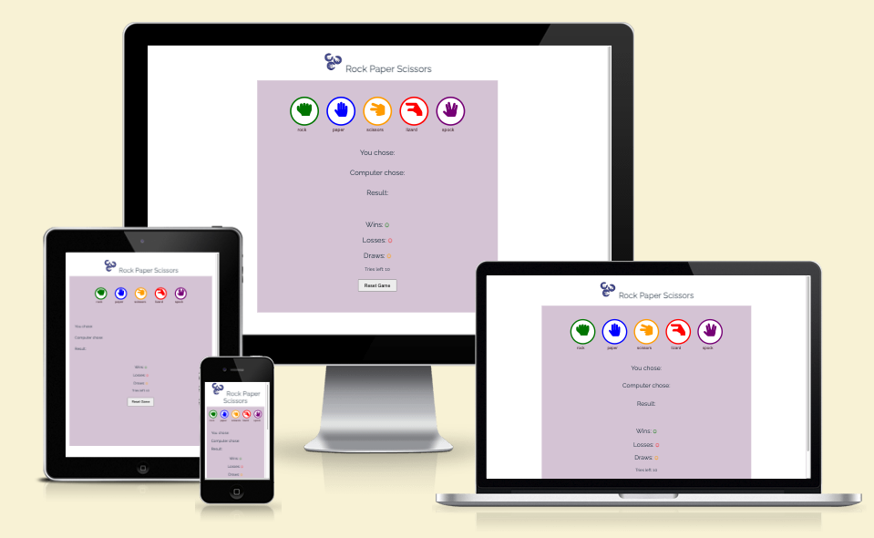
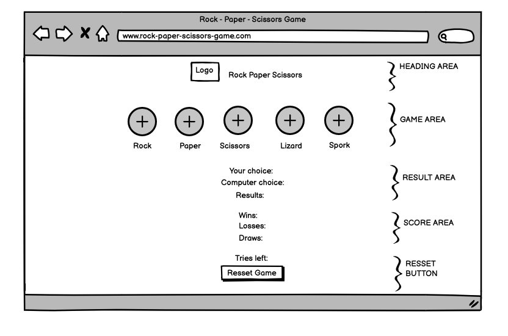
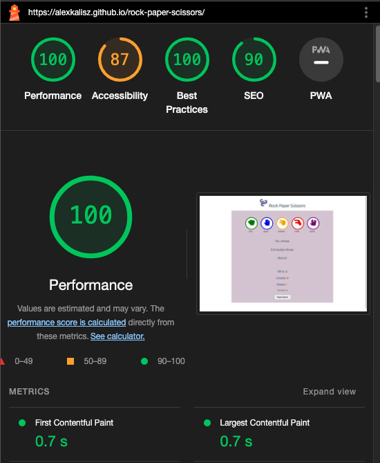

# Rock - Paper - Scissors Game

## Overview 
The Rock Paper Scissors Game is a simple yet entertaining project designed to let users play the classic game against a computer opponent. This project provides a fun way to spend time while also exercising strategic thinking and decision-making skills. Players can choose from various hand gestures, and the computer randomly selects its choice. The game keeps track of wins, losses, and draws, allowing players to see how well they're performing.

## Live Site

https://alexkalisz.github.io/rock-paper-scissors/

## Repository

https://github.com/alexkalisz/rock-paper-scissors

## Author 

Alexandra Kalisz

## User Experiance(UX)

### Target Audience
Rock, paper, scissors, lizard sock game is designed for diverse audience like cassual gamers, children and families, students,
 individuals who require accsible game design, including those who need screen readers and high contrast visuals.

### Project Goals
The primary goals of the Rock Paper Scissors game project are to provide entertainment,
 ensure accessibility and offer responsive design as well as promote user engagement.

## Wire Frame

## Features

### Controls Area

- Buttons for rock, paper, scissors, lizard, and spock gestures.
- Players can click on their choice to play against the computer.
- Reset game button, players can reset game anytime.

### Results Area

- Displays the choices made by player and the computer.
- Shows the results of each round (win, lose, draw).

  

### Score Area

- Tracks number of wins, loses and draws for the player.

### Tries Area

 - Shows number of tries left for player, the number counts down from 10 tries.
 - Reset button allows player to reset the count downs anytime back to 10.

### Future Features

In the feature game can have features like:
-  Multiplayer mode, allowing users to play against friends or other online opponents in real-time.
- Customizable themes and avatars will add a personal touch to the game.

## How to Play

- Click on one of the hand gesture buttons (rock, paper, scissors, lizard, or spock). 
- The computer will randomly select its choice. 
- The result of the round will be displayed. 
- Keep playing until you run out of tries or decide to reset the game.

## Testing
- The game has been tested and works in popular browsers such as Chrome, Firefox, Safari, and Brave.
- Responsive design ensures functionality on various screen sizes like Desktop, laptop, smartphone.
- The game logic has been validated to ensure accurate scores.
- The W3C Markup Validator and W3C CSS Validator Services were used to validate every page of the project to ensure there were no syntax errors in the project.

### HTML Validator
![HTML Validator] ()

### CSS Validator
! [CSS Validator] 

### Lighthouse Testing

## Credits

This game was inspired by similar projects and uses code snippets from the Love Running project, Love Maths project, Mindful Living Project and various Stack Overflow threads for specific functionalities as well as YouTube tutorials.

## Source Code

The code structure and logic for this game were adapted from several online resources as well as the Love Mats project from Code Institute, including Stack Overflow threads as well as ChatGPT was used to solve problems with java codes,  to create an interactive and engaging experience for players.
https://stackoverflow.com/questions/76196162/function-that-gets-button-click
https://stackoverflow.com/questions/70815987/rock-paper-scissors-player-choice-always-returns-null-js
https://stackoverflow.com/questions/73015826/javascript-innertext

### Media
- The logo image downloaded from:   https://www.hiclipart.com/free-transparent-background-png-clipart-havpw/download
- Fonts:  Font Awesome
- Tutorials: https://www.youtube.com/watch?v=wux_u6NXxq0
- Favicon icon :https://www.klipartz.com/en/sticker-png-hogig/download

## Deployment
- Website was deployed to GitHub, steps of deployment:
1. Go to Settings tab in the GitHub repository.
2. Clock Pages on the left side of the screen.
3. Using drop down menu in Source section - choose Main Branch.
4. Sellection of Main Branch will automatically refresh the page and shoe ribbon display to confirm successful deployment.

